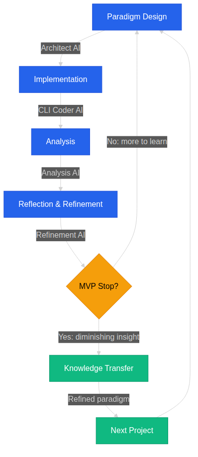

# The Recursive Loop

Ever wondered how a standard MIB cycle actually unfolds? Here’s the breakdown:

## Step 1 — Paradigm Design
Architect AI takes charge at this stage, crafting constraints and documentation. What emerges are meticulously structured design documents—ready for implementation.

## Step 2 — Implementation
Next up, CLI Coders step in to bring the spec to life. Their work yields a fully operational codebase.

## Step 3 — Analysis
With code in place, Analysis AI takes over. This specialized system examines the implementation, pinpointing structural patterns and compiling them into a detailed observational report.

## Step 4 — Reflection and Refinement
Insights in hand, Architect AI revisits the paradigm. Adjustments follow, informed by real-world data. The outcome? A refined meta-model—sharper and more closely aligned with actual needs.

## Step 5 — Intentional MVP Stop
Development halts here, but not because the work is complete. Over-optimizing features risks sacrificing deeper understanding, so this pause is deliberate.

## Step 6 — Knowledge Transfer
Now, the refined paradigm becomes the foundation for what follows. Each cycle elevates the abstraction floor, building on everything that came before.

---

**Also available as:**
[HTML (.com)](https://mib.lpmwfx.com) |
[HTML (.eu)](https://mib.lpmwfx.eu) |
[PDF](https://github.com/articles-lpmwfx/mib-series/releases/latest) |
[GitHub](https://github.com/articles-lpmwfx/mib-series) |
[Codeberg](https://codeberg.org/Articles-lpmwfx/mib-series) |
[SHA256](https://github.com/articles-lpmwfx/mib-series/blob/main/SHA256SUMS) |
[Feedback](https://codeberg.org/Articles-lpmwfx/mib-series/issues)
